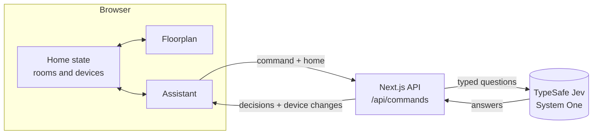

# Smart Home Assistant

A demo app showcasing Jev, the System One model from [TypeSafe AI](https://docs.typesafe.ai).

The demo home has rooms and devices; type what you want in natural language - "dim
the bedroom lights a bit", "turn off all the lights", "it is too warm in the living
room". One Jev call turns that sentence into a set of typed decisions. The home applies
them straight away, and the app shows every answer with its probabilities.

## Getting started

```bash
npm install
cp .env.example .env.local   # then set TYPESAFE_API_KEY
npm run dev
```

Open <http://localhost:3000>. The demo home starts fresh on every load.

```bash
npm run dev      # dev server
npm run build    # production build, including a full typecheck
npm run lint     # eslint
npm run format   # prettier
```

## How it works


